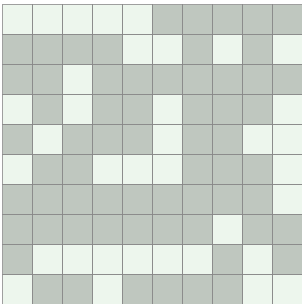
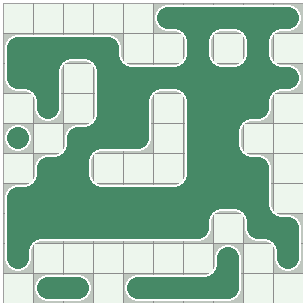

A JavaScript implementation of an algorithm that traces bitmap pixels to create continuous SVG path, with optionally rounded corners.

For example, from this:

we get this:

Can be used together with e.g. D3.js to create some fancy visuals.

[Online demo](http://www.ruslans.com/outline_demo/)